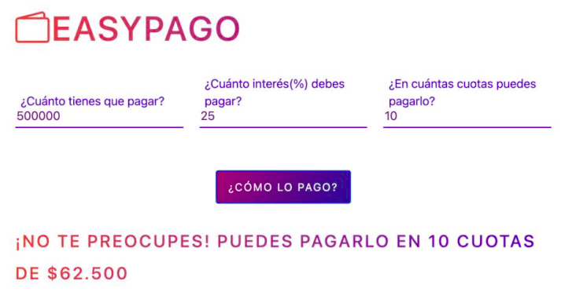

# MEJORANDO NUESTROBANK

EJERCICIO:
NuestroBank desea aumentar el número de sus clientes jóvenes. Para ello, el banco quiere crear una
aplicación web sencilla, que permite a este segmento de clientes gestionar de mejor manera sus gastos.
La aplicación será una calculadora de intereses y cuotas, que mostrará al usuario cuánto debe pagar, de
acuerdo con la cantidad de cuotas en las que se le permitió dividir la cantidad ingresada.

